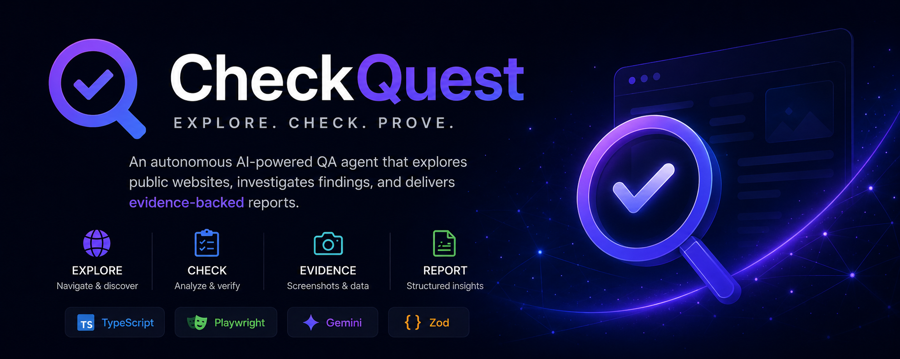

<p align="center">
  
</p>

# CheckQuest

An experimental **AI-powered exploratory web testing agent** built with **TypeScript, Playwright, Gemini, and Zod**.


Give CheckQuest a public URL and it can choose pages to inspect, identify suspicious content or behavior, perform constrained browser interactions, collect evidence, and generate structured QA reports.

> **AI decides what is worth investigating. Deterministic code controls what the browser is allowed to do.**

---

## 💡 Why This Project?

Traditional automation is excellent at checking known expectations:

```text
Given X
When Y
Then Z
```

Exploratory testing asks something different:

> **What might be wrong here that nobody explicitly wrote a test for?**

CheckQuest explores whether an AI agent can help answer that question without giving an LLM unrestricted control over a browser.

```text
Observe
   ↓
Form a QA hypothesis
   ↓
Request one approved action
   ↓
Validate it
   ↓
Execute with Playwright
   ↓
Observe again
   ↓
Decide what to do next
```

---

## 🚀 What Can It Do Today?

CheckQuest can:

- accept a public URL directly from the command line;
- explore multiple pages within an approved hostname;
- let Gemini choose representative pages to inspect;
- extract headings, links, buttons, fields, dropdowns, and visible text;
- collect console and network diagnostics;
- identify evidence-grounded candidate findings;
- perform bounded autonomous investigations;
- interact safely with supported UI controls;
- capture screenshot evidence;
- preserve page-level investigation history;
- deduplicate repeated findings into a site-wide view;
- generate JSON and Markdown reports.

A typical run looks like:

```text
Public URL
    ↓
Safe runtime configuration
    ↓
AI chooses a page
    ↓
Playwright opens and observes it
    ↓
AI identifies candidate findings
    ↓
Planner requests a supported action
    ↓
Deterministic code executes it
    ↓
Evidence is collected
    ↓
Repeated findings are grouped
    ↓
Reports are generated
```

---

## 🔍 A Real Issue It Found

During autonomous runs against the Aidoc public website, CheckQuest inspected a country dropdown and noticed both:

```text
Ecuador
Equador
```

Gemini identified `Equador` as a likely misspelled duplicate.

The agent then safely:

1. located the observed dropdown;
2. selected `Equador`;
3. selected the correctly spelled `Ecuador`;
4. confirmed that both values were available;
5. captured screenshot evidence;
6. stopped once sufficient evidence had been collected.

The same form appeared on several pages. Instead of reporting three separate defects, the final report grouped them into one site-wide finding:

```text
Unique finding:
Misspelled country option

Occurrences:
3

Affected pages:
3
```

The original page-level findings and screenshots remain preserved for traceability.

---

## 🧠 Autonomous Exploration

CheckQuest supports a bounded:

```text
observe → plan → act → observe
```

loop.

For every step, Gemini must provide:

- a QA hypothesis;
- reasoning;
- one supported action;
- the expected observation.

The request then passes through:

```text
Gemini planner
      ↓
Structured action
      ↓
Zod validation
      ↓
Deterministic TypeScript executor
      ↓
Playwright
      ↓
Browser
```

The planner may stop when:

- the finding is sufficiently evidenced;
- no useful supported action remains;
- the investigation cannot be performed safely;
- additional steps would add no meaningful evidence.

---

## 🔒 Safety by Design

Gemini never receives direct Playwright access.

Currently supported actions include:

```text
fill text field
clear text field
blur field
select native dropdown option
bounded scroll
stop exploration
```

Current restrictions include:

- no arbitrary selectors;
- no arbitrary JavaScript;
- no unrestricted clicking;
- no form submission;
- no destructive actions;
- no autonomous interaction with password fields;
- no navigation outside the approved hostname;
- strict page and action budgets;
- ambiguous or missing targets are rejected.

For raw-URL runs, only the exact supplied hostname is approved automatically.

---

## 🧩 Site-Wide Deduplication

AI wording can vary between pages:

```text
Misspelled country name in selection list
Misspelled country name in registration form
Misspelled country option in dropdown
```

These may describe the same underlying issue.

Where possible, CheckQuest creates a deterministic fingerprint from structured evidence:

```text
category
+
target type
+
control identity
+
target value
```

For the country issue:

```text
target|content|select-option|country|equador
```

The report can therefore show:

```text
Original occurrences: 3
Unique site-wide findings: 1
```

Findings without a machine-readable target use a conservative fallback. It is safer to leave some duplicates unmerged than to merge unrelated issues incorrectly.

---

## 🎛️ Runtime Controls

Explore a public website using safe defaults:

```bash
npm run agent:explore -- https://www.example.com/
```

Choose custom limits:

```bash
npm run agent:explore -- https://www.example.com/ --pages 5 --steps-per-page 4
```

Available options:

```text
--pages
Pages to inspect
Allowed range: 1–20

--steps-per-page
Autonomous investigation steps per page
Allowed range: 0–10
```

Run analysis without autonomous interaction:

```bash
npm run agent:explore -- https://www.example.com/ --pages 3 --steps-per-page 0
```

Invalid values are rejected before Chromium launches or Gemini is called.

---

## 🛠️ Tech Stack

- **TypeScript**
- **Playwright**
- **Gemini API**
- **Zod**
- **Node.js**
- **GitHub Actions**

The core agent remains generic. Websites can be provided through either:

- saved site configurations;
- arbitrary public URLs resolved into conservative runtime configurations.

---

## 🧪 Try It

Clone the repository:

```bash
git clone https://github.com/bootnihil/checkquest.git
cd checkquest
```

Install dependencies:

```bash
npm ci
npx playwright install chromium
```

Configure a Gemini API key on Windows:

```cmd
setx GEMINI_API_KEY "your-api-key"
```

Open a new terminal after running `setx`.

Run the deterministic Playwright suite:

```bash
npm test
```

Run project-wide TypeScript checking:

```bash
npx tsc --noEmit
```

Explore a public website:

```bash
npm run agent:explore -- https://www.example.com/
```

Run a saved site configuration:

```bash
npm run agent:run -- aidoc
```

Reports are written to:

```text
agent-results/<run-id>/report.json
agent-results/<run-id>/report.md
agent-results/<run-id>/evidence/
```

---

## ⚠️ Current Limitations

CheckQuest is still experimental.

Current limitations include:

- public, unauthenticated websites are the primary target;
- autonomous browser actions remain intentionally limited;
- custom JavaScript controls are not yet handled as broadly as native controls;
- raw-URL mode permits only the exact supplied hostname;
- findings still require human review;
- navigation can become more coverage-aware;
- the supplied start URL currently acts mainly as a launch point rather than a fully investigated page.

These limits are deliberate. New capabilities are added only when the corresponding safety and deterministic execution layers are ready.

---

## 🗺️ Roadmap

Next areas of work:

- explicit outcomes: **Verified**, **Not Verified**, and **Inconclusive**;
- full inspection of the supplied start URL;
- passive **security & infrastructure posture** checks such as HTTP security headers, TLS, cookies, and DNS;
- safe support for checkboxes, radio buttons, tabs, and accordions;
- smarter navigation and broader link discovery;
- stronger deterministic checks in CI;
- scheduled monitoring and comparison across runs.

---

## ✨ The Idea

CheckQuest combines:

```text
Deterministic automation
        +
AI reasoning
        +
Exploratory testing
        +
Strict safety boundaries
```

The goal is an agent that can independently look at a website and ask:

> **“What would a curious QA engineer test next?”**

Then safely go find out.

---

**CheckQuest — Explore. Check. Prove.**

**Status:** Experimental / Active Development