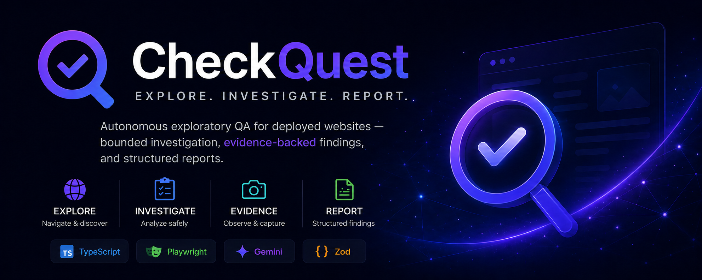

<p align="center">
  
</p>

# CheckQuest 🧭

[](https://github.com/bootnihil/checkquest/actions/workflows/quality.yml)


**Explore. Investigate. Report.**

**CheckQuest is an AI website tester that explores on its own.** Give it **any authorized HTTP(S) URL** instead of a predefined test suite. It looks for potential issues, safely investigates what it finds when an approved action can gather useful evidence, and produces a structured report. No site-specific profile is required for normal use.

> **Traditional automated tests check what you already told them to check. CheckQuest explores for potential problems you did not explicitly tell it to test for.**
>
> **AI decides what may be worth investigating. Deterministic code decides what the browser is actually allowed to do.**

## 🧭 More than an LLM with a browser

CheckQuest uses an LLM as one reasoning component, not as the authority on what is true. The surrounding QA system controls exploration budgets and browser actions, captures evidence, reconciles repeated observations, tracks finding state, and distinguishes what was merely suspected from what was actually verified.

A model can propose that something looks wrong. **It cannot make the finding true by saying so.**

**The model proposes. CheckQuest constrains, investigates, verifies, and reports.**

Under the hood, CheckQuest is deliberately **bounded and non-exhaustive**. It is closer to an automated exploratory QA pass than a crawler, a generic browser agent, or a replacement for a full regression suite.

## ✨ What it does

Today, CheckQuest can:

- fully inspect the configured start page and explore additional internal pages within explicit budgets;
- combine deterministic checks with Gemini-based QA analysis;
- prioritize page diversity and avoid spending the whole run on near-identical routes;
- carry known findings across the run so the same issue is not investigated over and over;
- tie autonomous investigation to concrete page-local candidates rather than letting the model click freely;
- safely investigate supported form controls, disclosures, and conventional ARIA tabs;
- collect diagnostics, screenshots, finding evidence, and passive main-document security observations;
- reconcile repeated observations into canonical findings with page occurrences;
- return a schema-v3 report in JSON and Markdown;
- expose structured progress events and categorized errors for programmatic callers.

The goal is not to prove a site is defect-free. It is to spend a small inspection budget intelligently and come back with useful evidence.

## 🗺️ Roadmap status

- **Roadmap v1 is complete.** The original Stage 1–10 engine roadmap has been fully accepted and is now a historical record.
- **Roadmap v2 is current.** It tracks the productization phase: exposing the finished engine through a local GUI/product shell, packaging it for normal users, and validating the product with external usage and bounded evaluation evidence.

If you want the current plan, start with **[Roadmap v2](docs/ROADMAP-V2.md)**. If you want the completed engineering history, see **[Roadmap v1](docs/ROADMAP.md)**.

## 🎯 Where CheckQuest fits

CheckQuest is most useful as an **evidence-oriented exploratory pass alongside a normal QA stack**. It does not replace scripted regression, manual exploratory testing, security testing, or site-quality tooling.

- **Playwright / Cypress / Selenium** execute tests you already defined. CheckQuest starts from a URL and decides where a bounded exploratory budget is worth spending.
- **Crawlers and site-quality platforms** are better suited to broad inventory and exhaustive rule-based scanning. CheckQuest deliberately favors representative coverage and evidence-gathering investigation over exhaustive crawling.
- **AI test-authoring tools** primarily help create or maintain test cases. CheckQuest's current product is the exploratory run and its evidence-backed report, not generated regression code.
- **Generic browser agents / thin AI wrappers** can ask a model to operate a browser and describe what it sees. CheckQuest adds the QA system around that intelligence: bounded exploration, deterministic action authority, evidence capture, finding reconciliation, and explicit verification semantics.
- **Security scanners** actively probe for vulnerabilities. CheckQuest does not: its current security posture layer is passive and observational.
- **Manual exploratory QA** retains richer human judgment and product context. CheckQuest trades some of that depth for a repeatable, bounded pass that can run without a predefined test suite.

That makes CheckQuest a complement to existing QA automation rather than a claim that one agent should replace the rest of the testing stack.

## 🧠 How it works

```text
Arbitrary URL / optional saved site profile
        ↓
Inspect page 1
        ↓
Deterministic checks + Gemini analysis
        ↓
Identify potential issues
        ↓
Investigate only when an approved action can gather evidence
        ↓
Add useful internal routes to the navigation frontier
        ↓
Inspect another page — or stop
        ↓
Unify findings + evidence
        ↓
Build the report
```

Navigation is constrained by deterministic host, budget, novelty, route-value, and visited-page policy. Gemini can help choose among eligible options; it does not get unrestricted browser authority.

For the deeper execution model, finding lifecycle, events, errors, and safety boundaries, see **[Architecture](docs/ARCHITECTURE.md)**.

### Evidence stays honest

A browser action succeeding does not automatically prove the broader QA claim. CheckQuest keeps interaction evidence separate from finding verification, so successful mechanics are not automatically promoted into verified conclusions.

**Mechanical success ≠ semantic proof.**

## 🛡️ Safety by design

CheckQuest is designed for cautious use against real websites, but “production-safe” is a design goal — not a promise that browser interaction can never have side effects.

Key boundaries:

- exploration is limited by page, navigation, and investigation budgets;
- autonomous actions must be linked to a concrete finding candidate;
- there is no generic arbitrary-click, CSS-selector, or JavaScript-execution authority;
- current site profiles disallow form submission;
- password-field pages suppress autonomous investigation;
- guarded disclosure/tab actions monitor risky behavior, collect deterministic evidence, require rollback, and fail closed when their safety conditions cannot be established;
- passive security uses only data produced by normal browsing and sends **no extra security probe traffic**.

CheckQuest is **not** a penetration-testing tool. Findings and safety outcomes still deserve human review.

## 🚀 Quick start

### 1. Check the prerequisites

CheckQuest currently supports a **fresh-clone source installation**. It is not
yet published as an npm package or standalone executable.

You need:

- Git;
- Node.js 22.13.0 or newer (an LTS release is recommended);
- npm 10 or newer;
- network access for npm, Chromium, the target website, and Gemini; and
- a user-owned Gemini API key for normal exploration.

Confirm the local toolchain:

```bash
node --version
npm --version
```

### 2. Install the locked dependencies and Chromium

```bash
git clone https://github.com/bootnihil/checkquest.git
cd checkquest
npm ci
npm run setup:browser
```

`npm ci` is the intended repository installation command and uses the committed
lockfile. On Linux systems that also need Playwright system packages, use:

```bash
npm run setup:browser:with-deps
```

### 3. Add your Gemini key

CheckQuest uses **BYOK — Bring Your Own Key**.

The CLI reads `GEMINI_API_KEY` from the current process environment and passes it into the run as an explicit per-run credential. Reusable `runSite(...)` callers can instead supply their own transient Gemini key directly. CheckQuest does not persist the key or include it in reports, events, or public errors. `GOOGLE_API_KEY` is intentionally not used as an implicit fallback, and `.env` files are not loaded automatically.

PowerShell:

```powershell
$env:GEMINI_API_KEY = "replace-with-your-key"
```

Windows cmd:

```bat
set GEMINI_API_KEY=replace-with-your-key
```

POSIX shell:

```sh
export GEMINI_API_KEY="replace-with-your-key"
```

### 4. Run it

The normal path is to supply the website you want CheckQuest to inspect directly. No named profile is required:

```bash
npm start -- https://www.example.com/ --pages 1 --navigation-steps 1 --steps-per-page 0
```

CheckQuest builds a conservative runtime profile automatically for the supplied hostname.

The repository also includes one **optional reference profile**, `aidoc`, because Aidoc was the project's original development and external regression target. It is not the only supported site and is not required for arbitrary-URL runs:

```bash
npm start
```

The existing explicit aliases remain available:

```bash
npm run agent:run
npm run agent:explore -- https://www.example.com/
```

`start`, `agent:run`, and `agent:explore` use the same CLI entry point.

For a deliberately small first-run walkthrough, including what to inspect in the generated report, see the **[Guided demo](docs/DEMO.md)**.

## 🎛️ Control the run

| Option | Meaning | Range |
|---|---|---:|
| `--pages` | Inspected-page budget | 1–20 |
| `--navigation-steps` | Navigation-decision budget | 1–50 |
| `--steps-per-page` | Investigation budget per page | 0–10 |

Example:

```bash
npm run agent:explore -- https://www.example.com/ --pages 5 --navigation-steps 7 --steps-per-page 3
```

Set `--steps-per-page 0` to analyze pages without autonomous investigation.

For the normal arbitrary-URL path, current defaults are **3 / 4 / 3**. Arbitrary URLs use a conservative runtime profile scoped to the exact supplied hostname.

The optional built-in `aidoc` reference profile uses **5 / 6 / 3** because it doubles as a development/regression fixture. Reusable named profiles are an advanced convenience for sites that need persistent configuration; they are not required to run CheckQuest against other websites.

For reusable profiles, host policy, `SiteConfig`, model overrides, and configuration errors, see **[Configuration](docs/CONFIGURATION.md)**.

## 📄 What you get

Successful CLI runs write:

```text
agent-results/<run-id>/report.json
agent-results/<run-id>/report.md
agent-results/<run-id>/evidence/
```

- **JSON** contains the detailed schema-v3 execution record.
- **Markdown** is the human-readable summary.
- **Evidence** contains screenshots when captured.

Reports can contain target URLs, visible page content, browser diagnostics, model-derived observations, and screenshots. Treat the output directory accordingly. Gemini API keys are not included.

The current contract is fail-fast: a failed exploration does not produce a successful partial report.

## 🔒 Public compatibility

CheckQuest is currently on the **0.1.x initial-development release line**.
The source-distributed CLI and schema-v3 JSON report have explicit compatibility
rules even though the project is not yet a published SDK or 1.0 product.

For machine consumers, `reportSchemaVersion: "3"` is the report compatibility
signal. Existing fields cannot be removed, renamed, change type, or materially
change meaning within schema v3; additive fields may be introduced. The
Markdown report is a human-readable projection and is not a machine-stable
format.

For CLI automation, exit code **0** means the exploration completed and both
`report.json` and `report.md` were persisted successfully. Exit code **1**
means the CLI run or report delivery failed; callers should not infer success
merely because an artifact happens to exist from a partially completed
persistence sequence.

The supported CLI/configuration surface, version policy, report compatibility
rules, and deliberately non-versioned source API are defined in
**[Public contracts](docs/PUBLIC-CONTRACTS.md)**.

## 🩺 Common setup failures

| Message or symptom | Meaning and next step |
|---|---|
| `EBADENGINE` during installation | Install Node.js 22.13.0+ and npm 10+, then rerun `npm ci`. |
| `GEMINI_API_KEY is required` | Set `GEMINI_API_KEY` in the same shell that starts CheckQuest. `GOOGLE_API_KEY` is not a fallback. |
| `Unable to launch Chromium` | Run `npm run setup:browser`. On Linux, use `npm run setup:browser:with-deps`. |
| Chromium reports missing Linux libraries | Install the Playwright system packages with `npm run setup:browser:with-deps`. |
| `Unknown site configuration` | Provide a complete URL beginning with `http://` or `https://`. The optional built-in `aidoc` name is only a reference profile. |
| A `MODEL` error occurs after requests begin | Check the Gemini key, optional `GEMINI_MODEL`, network access, quota, and provider availability. |
| Report persistence fails | Run from a writable checkout and verify access to `agent-results/`. Failed runs do not emit a successful partial report. |

CheckQuest intentionally prints bounded public errors rather than raw SDK
responses or stack traces. See
[Configuration errors](docs/CONFIGURATION.md#configuration-errors) for the
detailed CLI contract.

## 🧪 Development and verification

The normal local gates are:

```bash
npm run check
npm run test:browser:ci
```

`npm run check` runs typechecking, ESLint, Markdown lint, and the browser-free deterministic suite.

`npm run test:browser:ci` runs the mandatory local Chromium acceptance suite against loopback fixtures — no Gemini key and no external Aidoc dependency required.

`npm test` / `npm run test:ui` is the project's separate **manual external Aidoc regression acceptance** suite. Aidoc is used there as a stable development/reference target; normal CheckQuest usage is not limited to Aidoc or to preconfigured sites.

## ⚠️ Current boundaries

CheckQuest is still experimental.

- Exploration is bounded rather than exhaustive.
- The autonomous action vocabulary is intentionally narrow.
- Safety controls reduce risk; they cannot guarantee zero side effects on arbitrary sites.
- Passive security is observational, not active vulnerability scanning.
- Normal exploration currently depends on Gemini.
- One optional reusable reference profile (`aidoc`) ships today; arbitrary authorized URLs are the normal general-purpose path and do not require a profile.
- Failed runs do not have a partial-report schema.
- CheckQuest is not yet packaged as a desktop app, hosted service, or standalone SDK.

## 🗺️ What's next

The original engine roadmap is complete. **[Roadmap v2 — Public Landing + Local GUI / Product Shell](docs/ROADMAP-V2.md)** tracks the current productization phase: exposing the existing CheckQuest engine through a usable local interface, packaging it for normal users, and validating the result through external usage and bounded controlled evaluation before committing to SaaS or major new engine capabilities.

Roadmap v2 deliberately stops at a product-validation gate so real user behavior and evaluation evidence — not speculative feature ideas — determine what should be built next.

## 📚 Go deeper

- **[Guided demo](docs/DEMO.md)** — a minimal first run and report-reading walkthrough.
- **[Architecture](docs/ARCHITECTURE.md)** — execution flow, `runSite`, findings, investigation, safety, events, errors, passive security, and reporting.
- **[Configuration](docs/CONFIGURATION.md)** — site profiles, arbitrary URLs, budgets, host policy, BYOK, and model settings.
- **[Public contracts](docs/PUBLIC-CONTRACTS.md)** — supported CLI/configuration behavior, versioning, exit semantics, and report compatibility.
- **[Roadmap v2](docs/ROADMAP-V2.md)** — **current** public-landing, local product-shell, packaging, and product-validation roadmap.
- **[Roadmap v1](docs/ROADMAP.md)** — **completed** Stage 1–10 engine roadmap and historical development record.
- **[Backlog](docs/BACKLOG.md)** — active, queued, and parked work.

## ⚖️ Licensing

CheckQuest is **source-visible but not currently released under an open-source license**. The package metadata is intentionally marked `UNLICENSED`. No additional permission to use, modify, or redistribute the source is granted by this repository beyond rights provided by GitHub's platform terms and applicable law.

The long-term licensing and distribution model is intentionally undecided. Roadmap v2 defers that decision until the product-validation gate, so any open-source, source-visible/proprietary, open-core, or other commercial model is chosen deliberately from actual product evidence rather than inferred from the repository being public.

## 🔧 Built with

TypeScript · Playwright · Gemini API · Zod · Node.js · GitHub Actions

**Status:** Experimental / active development
