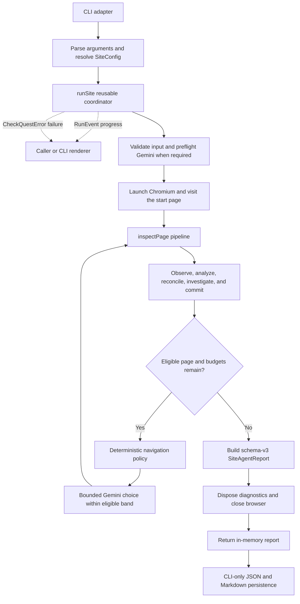

# CheckQuest Architecture

This document describes the current runtime architecture and the supported
programmatic execution seam. It is intentionally conceptual: source links point
to the authoritative contracts, but the document is not a file-by-file
walkthrough or a promise of a stable published SDK.

For installation, CLI usage, reports, and contributor commands, see the
[README](../README.md).

## Architectural goals

CheckQuest is organized around a small reusable core with these constraints:

- production-safe, bounded interaction with public websites;
- deterministic policy and verification around model-assisted decisions;
- presentation-agnostic and deployment-agnostic execution;
- one canonical run-level finding model with traceable occurrences and
  evidence;
- passive security observation without additional probe traffic;
- bring-your-own-key (BYOK) Gemini access without key persistence or exposure;
- explicit, privacy-safe progress and failure contracts; and
- required cleanup that does not hide an earlier operational failure.

The current CLI is one adapter around that core. A future desktop or web
frontend can call the same coordinator and consume its events and in-memory
report without moving CLI rendering, filesystem persistence, or process-exit
behavior into the engine.

## Execution overview



The configured start page is always the first inspected page. Page count,
site-level navigation steps, and per-page investigation steps are separate
budgets.

## CLI adapter and reusable core

The [CLI entry point](../agent/run-site-agent.ts) owns:

- parsing command-line arguments and applying overrides to the selected site
  configuration;
- creating CLI-oriented run metadata;
- rendering `RunEvent` values;
- writing JSON and Markdown reports after a successful core run;
- printing the final public error; and
- setting process exit behavior.

The [run coordinator](../agent/run/run-site.ts) owns:

- reusable input validation;
- Gemini credential preflight when default model collaborators may be used;
- browser, diagnostics, passive-security, and run-state lifecycles;
- start-page navigation and bounded multi-page coordination;
- calls to the per-page inspection pipeline;
- canonical finding and passive-security aggregation;
- construction of the in-memory successful report;
- required resource cleanup; and
- ordered progress and terminal events.

The coordinator does not parse CLI arguments, render progress, write report
files, or terminate a process. A programmatic caller can omit the event
observer and run silently.

## Programmatic `runSite` API

The source-level API is defined by
[`RunSiteInput`](../agent/run/run-site.ts) and returns a
[`SiteAgentReport`](../agent/reporting/report-types.ts):

```ts
const report = await runSite({
  site,
  startedAt,
  runId,
  onEvent,
  dependencies: {
    analyzePageForQa,
    chooseNavigationLink
  }
});
```

Only `site` is required:

| Input | Meaning |
|---|---|
| `site` | Validated execution limits, start URL, allowed hosts, and form policy |
| `startedAt` | Optional valid `Date`; generated when omitted |
| `runId` | Optional filesystem-safe identifier; generated when omitted |
| `onEvent` | Optional synchronous `RunEvent` observer |
| `dependencies.analyzePageForQa` | Optional page-analysis collaborator |
| `dependencies.chooseNavigationLink` | Optional navigation-choice collaborator |

The two dependency overrides are narrow test and embedding seams. They do not
form a general dependency-injection, provider, or plugin framework. If either
default Gemini-backed path can be reached, `runSite` resolves the BYOK
credential before launching Chromium. A fully injected local integration can
therefore exercise real browser coordination without Gemini.

`runSite` resolves only after required browser cleanup succeeds. It returns a
complete successful report or rejects; it does not return a partial success
report after an operational failure. Evidence such as a screenshot captured
before a later failure may still exist on disk.

## Configuration and input validation

The reusable [`SiteConfig`](../agent/config/site-config.ts) contains:

- `id`, `name`, and `startUrl`;
- `allowedHosts`;
- `maxPages`;
- `maxAgentSteps`, exposed by the CLI as navigation steps;
- `maxExploratoryStepsPerPage`; and
- `allowFormSubmission`.

[`validateRunSiteInput`](../agent/run/validate-run-site-input.ts) runs before
browser work. It requires an HTTP or HTTPS start URL whose hostname is in the
non-empty allowed-host list, validates each budget as a safe whole number,
requires a Boolean form policy, validates `startedAt`, and constrains an
explicit `runId` to a safe 1-128 character form. Invalid reusable input fails
with `CONFIGURATION`.

CLI parsing and site-specific defaults remain outside this reusable validation
boundary. See [CheckQuest Configuration](CONFIGURATION.md) for the current CLI
contract, target profiles, environment variables, and profile-authoring
reference.

## Progress contract: `RunEvent`

[`RunEvent`](../agent/run/run-event.ts) is a discriminated union intended for
presentation adapters. Current event types are:

| Phase | Event types |
|---|---|
| Run | `run-started`, `run-completed`, `run-failed` |
| Page inspection | `inspection-started`, `inspection-completed` |
| Navigation | `navigation-started`, `navigation-completed` |
| Model request | `model-request-started`, `model-request-retrying`, `model-request-completed` |
| Investigation | `investigation-completed` |

Events are delivered synchronously in execution order. Observer exceptions and
rejected thenables are isolated so presentation code cannot alter run
behavior. Callbacks are not awaited. Omitting the observer is a no-op.

After valid input, a run emits `run-started` and exactly one terminal
`run-completed` or `run-failed`. Input rejected before a caller-supplied run ID
is trusted can emit `run-failed` with the fixed safe run identity
`unavailable`. `run-completed` is emitted only after required core cleanup;
CLI persistence happens later and is not part of the core event lifecycle.

Event payloads contain bounded operational context and sanitized display URLs.
They do not contain API keys, prompts, raw model responses, SDK causes, page
content dumps, or cleanup error chains.

## Failure contract: `CheckQuestError`

[`CheckQuestError`](../agent/errors/checkquest-error.ts) is the typed failure
boundary for expected operational failures. Its current codes are:

| Code | Responsibility |
|---|---|
| `CONFIGURATION` | Invalid reusable input or missing required configuration |
| `BROWSER` | Browser launch or browser-level operation |
| `NAVIGATION` | Start-page or approved-link navigation |
| `MODEL` | Gemini request, transport, timeout, or service failure |
| `MODEL_RESPONSE` | Invalid or unusable model output |
| `REPORTING` | Successful report construction or CLI persistence |
| `CLEANUP` | Required cleanup failed without an earlier primary failure |
| `INTERNAL` | Unexpected or invalid internal failure value |

An error can carry bounded context such as phase, run ID, page number,
navigation step, candidate reference, requested and final URLs, status code,
and retryability. Its `cause` and secondary cleanup chain remain diagnostic
internals. [`formatPublicError`](../agent/errors/checkquest-error.ts) exposes
only the safe code, message, and selected context.

Unsafe or inconclusive investigative actions normally produce structured
results, not exceptions. `CheckQuestError` is for execution failure, not a
finding-verification state. Classified operational failures use
`CheckQuestError`; genuinely unexpected internal defects can still surface as
native errors, while event and CLI presentation of unknown failures stays
generic.

## Required cleanup

[`completeRequiredCleanup`](../agent/errors/required-cleanup.ts) attempts every
registered cleanup operation. If execution already failed, that error remains
primary and cleanup failures are attached as secondary diagnostics. If
execution succeeded but required cleanup fails, the first cleanup failure
becomes a `CLEANUP` error and later cleanup failures are chained behind it.

The coordinator applies this rule at nested ownership boundaries: page
diagnostics are disposed before the outer browser is closed. A successful
report is not returned until both boundaries complete.

## Per-page inspection pipeline

[`inspectPage`](../agent/inspection/inspect-page.ts) is the page-level
coordinator. For each already-navigated page it performs this ordered work:

1. register the passive main-document security snapshot captured during normal
   navigation;
2. allow a bounded stabilization period, then snapshot and classify browser
   diagnostics;
3. evaluate deterministic page rules;
4. extract bounded page content and inspect eligible navigation links;
5. register observed page identity and run-level novelty;
6. prepare compact known-finding context;
7. request evidence-grounded exploratory QA analysis;
8. reconcile raw model candidates with rules and findings already known in the
   run;
9. perform bounded, candidate-linked investigation when eligible;
10. deterministically derive an outcome for every candidate;
11. capture a screenshot only when the evidence policy calls for one;
12. validate and commit the complete page finding lifecycle; and
13. update the navigation frontier and inspected-final-URL state.

The pipeline returns page detail plus run-level metrics. It receives the
long-lived registries and navigation state from `runSite`; it does not own
browser launch, cross-page scheduling, report persistence, or process output.

## Navigation and run-level exploration

Navigation is deliberately split between deterministic policy and a bounded
model choice:

- [`inspectNavigation`](../agent/browser/inspect-navigation.ts) discovers
  visible, eligible internal links.
- The [navigation frontier and policy](../agent/exploration/navigation-policy.ts)
  track discovery provenance, traversal depth, predicted area and route-family
  identity, novelty, route value, and the remaining budgets.
- Deterministic policy selects the best eligible candidate band.
- [`chooseNavigationLink`](../agent/decisions/choose-navigation-link.ts) can use
  Gemini only to choose within that band.
- [`visitApprovedLink`](../agent/browser/visit-approved-link.ts) records
  requested and final URLs. Redirect aliases and already-inspected final URLs
  do not create duplicate page inspections.

Low-value routes can be deferred without being globally forbidden. Exploration
stops when no eligible work remains or a page/navigation budget is reached. It
is bounded sampling, not exhaustive crawling, and does not prove the absence
of defects.

Browser navigation and action execution are not automatically retried.

## Findings, evidence, and verification

The [unified finding model](../agent/findings/finding-model.ts) is the
authoritative functional finding contract. A logical finding has a stable
fingerprint, one or more occurrences, traceable evidence, and a conservative
verification state.

The [run finding lifecycle](../agent/findings/run-finding-lifecycle.ts):

- prepares known-finding context for later page analysis;
- reconciles deterministic rules, model candidates, and known occurrences;
- validates candidate references and complete candidate/result association
  before mutating run state;
- commits new findings and occurrences to the canonical registry; and
- supplies metrics used by reporting.

Candidate references are identities, not array positions. Missing, duplicate,
stale, or mismatched result references are rejected rather than silently
associated with the wrong finding.

[`UnifiedFindingRegistry`](../agent/findings/unified-finding-registry.ts) is the
single canonical run-level authority. The separate
[`KnownFindingState`](../agent/investigation/known-findings.ts) provides compact
context to later analysis and tracks occurrence reconciliation; it is not
another report authority. Per-page raw detail remains available, and
`siteWideExploratoryFindings` is a compatibility projection derived from the
canonical collection rather than a second authority. Redundant investigation
is suppressed only when canonical verification supports it.

Verification is assertion-specific and evidence-capability-aware. Mechanical
success does not automatically verify the broader semantic claim. The
regression sentinel with fingerprint
`target|select-option|country|equador` demonstrates this boundary: selecting
the native `Equador` option can be mechanically `VERIFIED`, while the canonical
semantic typo finding remains `INCONCLUSIVE` without verification-capable proof
of that assertion. It therefore must not trigger verified known-finding
suppression.

## Candidate-driven investigation

Gemini analysis proposes evidence-grounded candidate findings with structured
targets. Investigation is not free-form browsing:

- only candidates accepted by reconciliation receive page-local references;
- planner decisions must reference an active candidate;
- the prepared candidate identity remains authoritative through result commit;
- schemas, relevance checks, action eligibility, allowed-host checks, and
  per-page step limits constrain execution;
- action results and before/after evidence are recorded; and
- deterministic outcome evaluation, not Gemini, decides `verified`,
  `not-verified`, or `inconclusive`.

Current action kinds are intentionally narrow: fill, clear, or blur an
identified text field; select an observed native option; scroll within a
bounded viewport count; perform a guarded disclosure or tab interaction; or
stop. Stop is an explicit structured decision when no useful permitted
candidate-linked action remains. CheckQuest does not expose arbitrary
selectors, arbitrary clicks, or arbitrary JavaScript execution.

## Guarded click-like interaction boundary

Disclosure and tab actions share the
[guarded-interaction safety boundary](../agent/browser/guarded-interaction-safety-boundary.ts).
Pages are prepared before the first navigation so request and WebSocket state
can be tracked for the lifetime of the page.

Before a click-like action, the boundary requires a bounded network-quiet
period and rejects an already unsafe environment. While the action is armed it
blocks outbound requests and observes mutation, navigation, popup, download,
origin, URL, form, and realtime-channel hazards. Browser-side guards also
cover APIs such as fetch, XHR, beacon, form submission, history changes,
`window.open`, and WebSocket sends.

Action-specific code still owns target eligibility, preflight state,
transition evidence, and exact rollback. A safety breach returns a structured
`unsafe` result and can disable further click-like interactions for the page
or run. The boundary does not weaken browser security or claim that arbitrary
interaction is safe. Production-safe behavior is an engineering goal, not a
formal guarantee of no side effects.

This transaction is specific to disclosure and tab clicks. It is not a generic
wrapper around all action types.

## Passive security inspection

Passive security is a separate deterministic subsystem:

- [`capture-main-document-security`](../agent/security/capture-main-document-security.ts)
  observes the response and redirect chain produced by ordinary navigation;
- [`evaluate-passive-security`](../agent/security/evaluate-passive-security.ts)
  derives allowlisted posture observations; and
- the [passive security registry](../agent/security/passive-security-registry.ts)
  aggregates logical observations and occurrences.

The current observation codes are:

- `PS_HTTP_DOCUMENT`;
- `PS_HSTS_NOT_OBSERVED`;
- `PS_HSTS_NOT_ENFORCING`;
- `PS_CSP_RESPONSE_HEADER_NOT_OBSERVED`;
- `PS_NOSNIFF_NOT_ENFORCING`;
- `PS_FRAME_POLICY_NOT_OBSERVED`; and
- `PS_TECHNOLOGY_DISCLOSURE`.

The schema-v3 report identifies this subsystem as
`passive-observation-only`. It remains separate from functional findings,
Gemini analysis, candidate investigation, and canonical finding verification.

CheckQuest sends no additional traffic for passive security. It does not
perform penetration testing, active TLS or DNS probing, guessed-path requests,
cookie-posture analysis, infrastructure scanning, or exhaustive request
inventory. Values are allowlisted and sanitized before reporting.

## Gemini collaboration and BYOK

The production analysis, planner, and navigation-choice paths use Gemini as a
bounded collaborator. They resolve `GEMINI_API_KEY` explicitly; CheckQuest
does not fall back to `GOOGLE_API_KEY`. The key belongs to the user, is not
persisted by CheckQuest, and is not included in events, reports, prompts,
diagnostics, or public errors.

[`runGeminiRequest`](../agent/ai/run-gemini-request.ts) owns the shared request
boundary. The SDK receives no retry authority. CheckQuest allows at most two
total attempts and retries only bounded transient transport or timeout
conditions and HTTP status `408`, `429`, `500`, `502`, `503`, or `504`.
Schema-invalid or malformed model output is parsed outside that boundary and
fails as `MODEL_RESPONSE` without retry.

Prompts provide bounded observations and deterministic policy context. Model
output is untrusted until schema parsing and deterministic validation succeed.

## Reporting and persistence

[`buildSiteAgentReport`](../agent/reporting/build-site-agent-report.ts)
constructs the successful in-memory report. The
[`SiteAgentReport`](../agent/reporting/report-types.ts) contract has
`reportSchemaVersion: "3"` and includes:

- run identity, timestamps, site identity, homepage observation, and outcome;
- full inspected-page observations, diagnostics, model analysis,
  investigation transcripts, evidence, and navigation provenance;
- canonical run-level `findings`;
- the derived `siteWideExploratoryFindings` compatibility projection;
- the separate passive-security report; and
- aggregate finding, occurrence, diagnostic, and exploration metrics.

The CLI writes `report.json` first and then the Markdown projection under
`agent-results/<runId>/`. Screenshots are evidence captured during execution,
not a persistence concern of `runSite`. A persistence failure is a
`REPORTING` delivery failure after core execution has completed; it does not
retroactively produce a partial successful core report.

Reports and screenshots can contain target URLs, visible site content,
diagnostics, and model-derived observations. They should be handled as
potentially sensitive artifacts. Gemini API keys are excluded.

## Testing seams

The architecture supports three deliberately different verification layers:

- browser-free deterministic checks exercise schemas, policies, lifecycle
  integrity, reporting, errors, events, and regression sentinels;
- local loopback Chromium checks exercise real browser safety, navigation,
  passive response capture, and coordinator cleanup without Gemini or an
  external site; and
- optional external Aidoc or real Gemini checks remain separate from mandatory
  contributor and CI success.

The injected page-analysis and navigation-choice collaborators are sufficient
for real `runSite` browser integration without widening the production API.
Most lower-level policies and registries are plain deterministic modules and
can be tested directly.

See [Development and verification](../README.md#development-and-verification)
in the README for the current contributor commands and CI split.

## Deliberate boundaries and non-goals

The following boundaries are intentional:

- the reusable core has no CLI rendering, process control, or report-file
  persistence;
- `RunEvent` is a progress contract, not a general event bus, logger, or remote
  telemetry protocol;
- model dependency overrides are narrow collaborators, not a provider or
  plugin architecture;
- canonical findings and passive-security observations remain separate;
- compatibility report projections are derived, not parallel authorities;
- deterministic policy constrains every model-assisted navigation or action;
- failed runs reject instead of returning an apparently successful partial
  report;
- there is no partial failed-run report schema;
- browser navigation and action retries are not inferred from safe Gemini
  request retries; and
- the source-level API is reusable but is not yet a versioned package or a
  published SDK contract.

CheckQuest currently provides a CLI, not a Windows GUI, browser frontend, SaaS
control plane, general crawler, active security scanner, or arbitrary browser
automation platform. Those possible presentation and deployment choices do
not belong in the core execution model.
